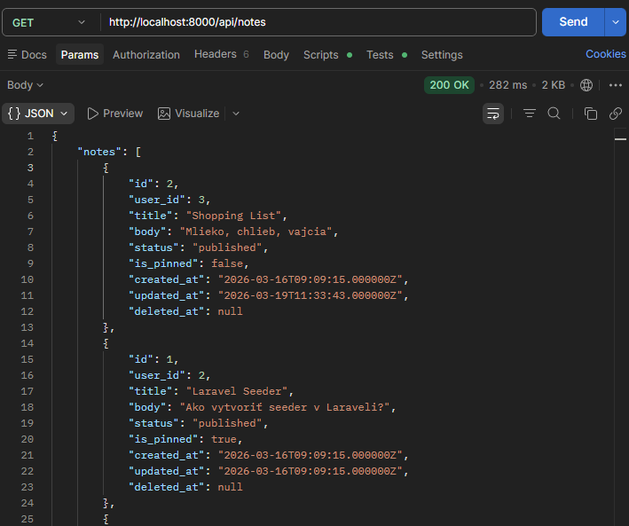
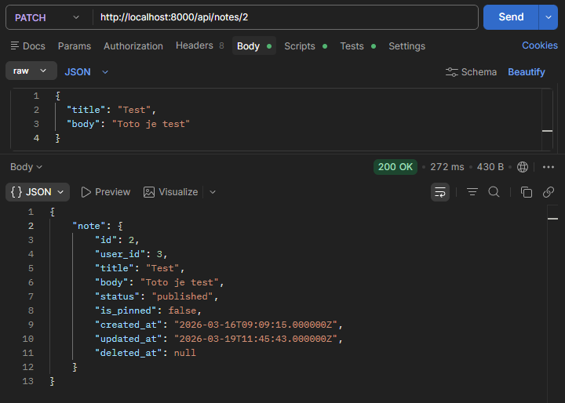
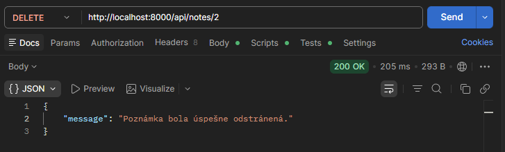
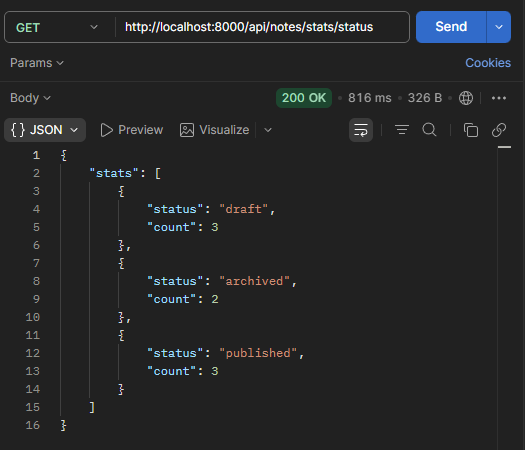
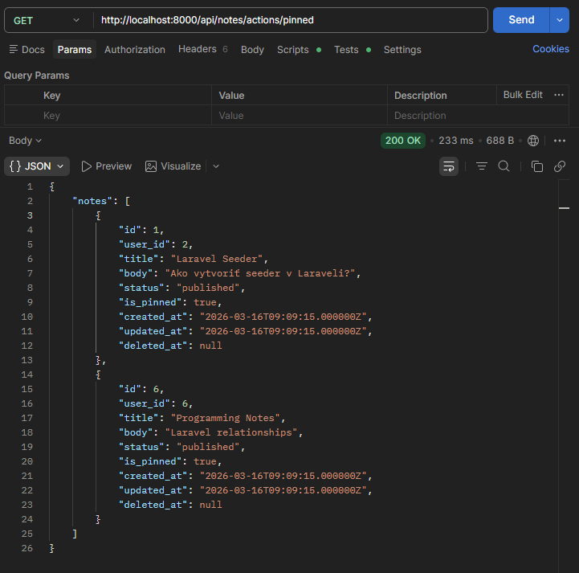
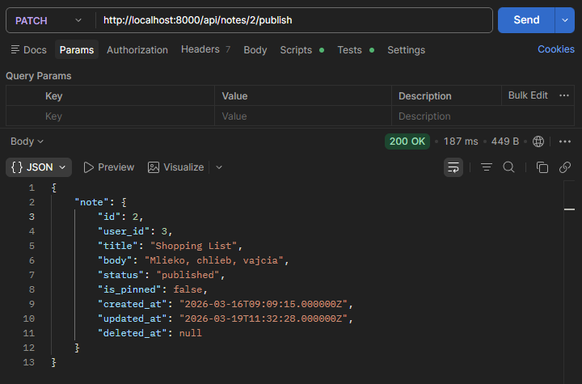
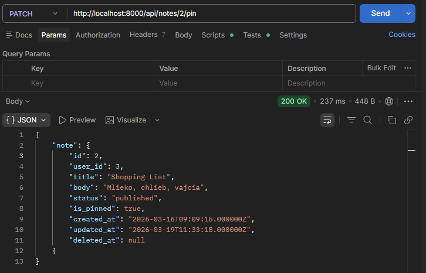
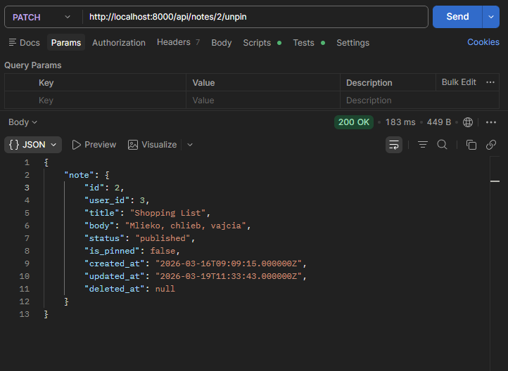
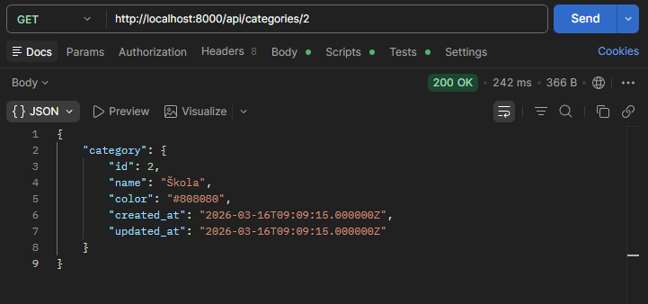
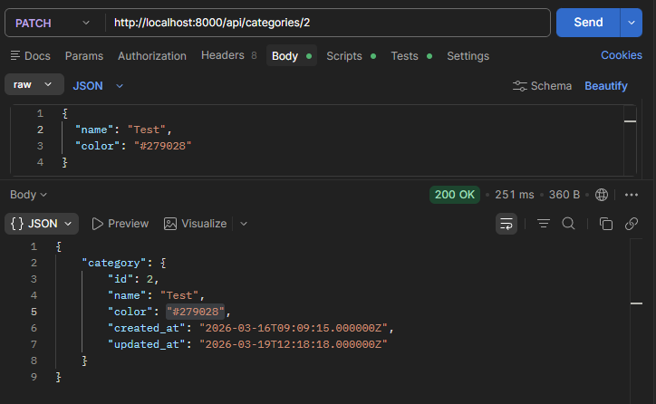

# Notes REST API – Laravel

## Získanie všetkých poznámok

**URI**

```
http://localhost:8000/api/notes
```



---

## Získanie jednej poznámky

**URI**

```
http://localhost:8000/api/notes/{id}
```

Príklad:

```
http://localhost:8000/api/notes/2
```


---

## Vytvorenie novej poznámky

**URI**

```
http://localhost:8000/api/notes
```


---

## Aktualizácia poznámky

**URI**

```
http://localhost:8000/api/notes/{id}
```

Príklad:

```
http://localhost:8000/api/notes/2
```



---

## Odstránenie poznámky (soft delete)

**URI**

```
http://localhost:8000/api/notes/{id}
```

Príklad:

```
http://localhost:8000/api/notes/2
```



---

# Ďalšie endpointy

## Vyhľadávanie poznámok

Vyhľadáva poznámky podľa textu v **title** alebo **body**.

**URI**

```
http://localhost:8000/api/notes-actions/search?q=lara
```


---

## Štatistika podľa statusu

**URI**

```
http://localhost:8000/api/notes/stats/status
```



---

## Archivovanie starých draftov

**URI**

```
http://localhost:8000/api/notes/actions/archive-old-drafts
```


---

## Poznámky používateľa s kategóriami

**URI**

```
http://localhost:8000/api/users/{user}/notes
```

Príklad:

```
http://localhost:8000/api/users/2/notes
```


---

## pinned notes

Endpoint vracia všetky pripnuté poznámky (`is_pinned = true`).

**URI**

```
http://localhost:8000/api/notes/actions/pinned
```



---

## Publikovanie poznámky

**URI**

```
http://localhost:8000/api/notes/{id}/publish
```

Príklad:

```
http://localhost:8000/api/notes/2/publish
```

---

## Pripnutie poznámky

**URI**

```
http://localhost:8000/api/notes/{id}/pin
```

Príklad:

```
http://localhost:8000/api/notes/2/pin
```

---

## Odopnutie poznámky

**URI**

```
http://localhost:8000/api/notes/{id}/unpin
```

Príklad:

```
http://localhost:8000/api/notes/2/unpin
```

---

# Categories REST API – Laravel

## Získanie všetkých kategórií

**URI**

```
http://localhost:8000/api/categories
```


---

## Získanie jednej kategórie

**URI**

```
http://localhost:8000/api/categories/{id}
```

Príklad:

```
http://localhost:8000/api/categories/2
```



---

## Vytvorenie novej kategórie

**URI**

```
http://localhost:8000/api/categories
```


---

## Aktualizácia kategórie

**URI**

```
http://localhost:8000/api/categories/{id}
```

Príklad:

```
http://localhost:8000/api/categories/2
```



---

## Odstránenie kategórie

**URI**

```
http://localhost:8000/api/categories/{id}
```

Príklad:

```
http://localhost:8000/api/categories/2
```


---


# Testovanie API

API bolo testované pomocou nástroja **Postman**.
Každý endpoint bol overený pomocou HTTP requestov a odpovedí vo formáte **JSON**.

---

# Autor

Nikola Černá
