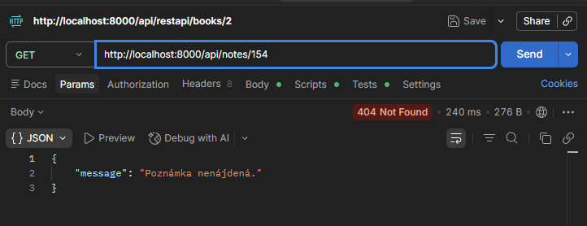
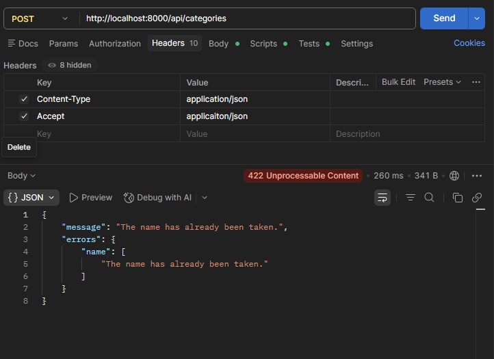
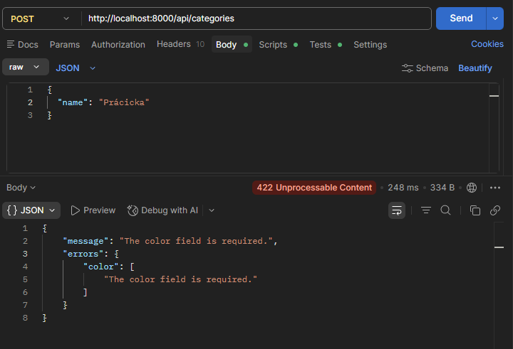
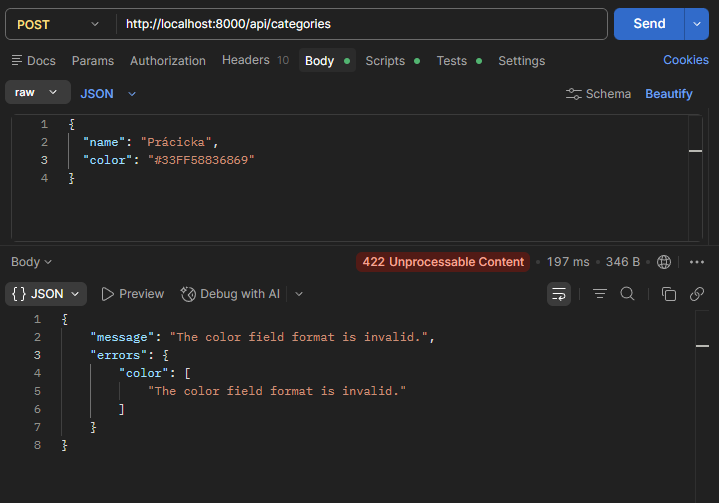
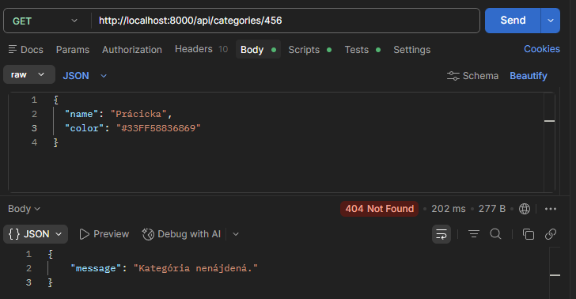
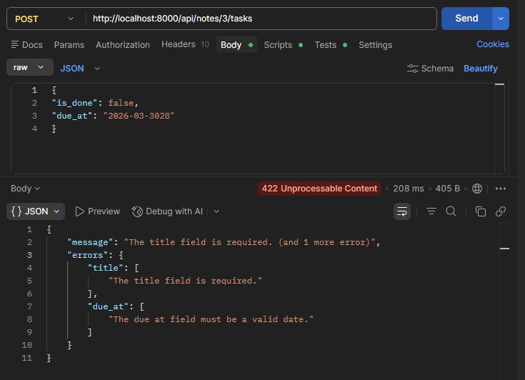
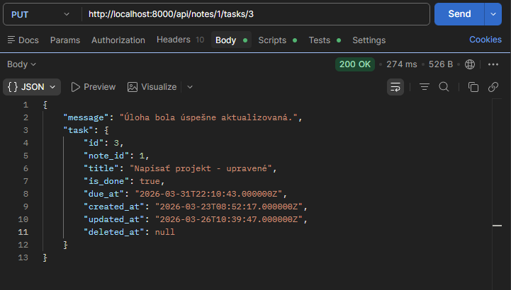

NoteController - show

NoteController - show error

CategoryController — store (duplicitný názov)

CategoryController — store (chýbajúce pole)

CategoryController — store (zlý formát farby)

CategoryController — show (neexistujúci záznam)

TaskController — index

TaskController — store (zlý dátum a chýbajúci title)

TaskController — update

