# Notes REST API – Laravel

## Získanie všetkých poznámok

**URI**

```
http://localhost:8000/api/notes
```

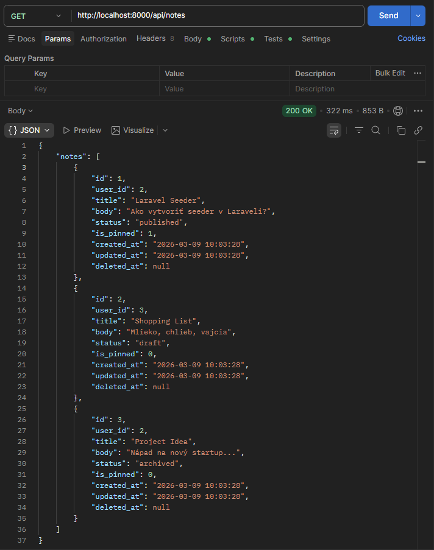

---

## Získanie jednej poznámky

**URI**

```
http://localhost:8000/api/notes/{id}
```

Príklad:

```
http://localhost:8000/api/notes/2
```

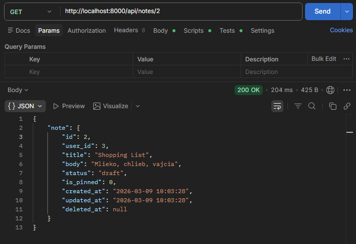

---

## Vytvorenie novej poznámky

**URI**

```
http://localhost:8000/api/notes
```

**Body**

```json
{
  "user_id": 2,
  "title": "Moja prvá poznámka",
  "body": "Toto je obsah poznámky."
}
```

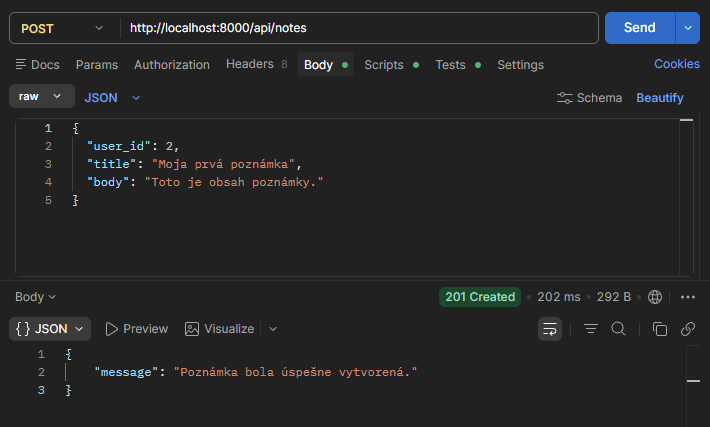

---

## Aktualizácia poznámky

**URI**

```
http://localhost:8000/api/notes/{id}
```

Príklad:

```
http://localhost:8000/api/notes/4
```

**Body**

```json
{
  "title": "Nový názov poznámky",
  "body": "Toto je upravený obsah poznámky."
}
```

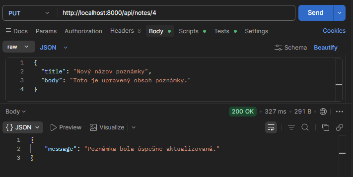

---

## Odstránenie poznámky (soft delete)

**URI**

```
http://localhost:8000/api/notes/{id}
```

Príklad:

```
http://localhost:8000/api/notes/4
```

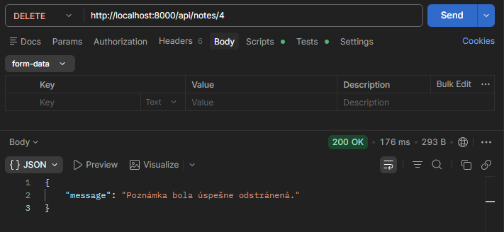

---

# Vlastné endpointy

## Vyhľadávanie poznámok

Vyhľadáva poznámky podľa textu v **title** alebo **body**.

**URI**

```
http://localhost:8000/api/notes-actions/search?q=Laravel
```

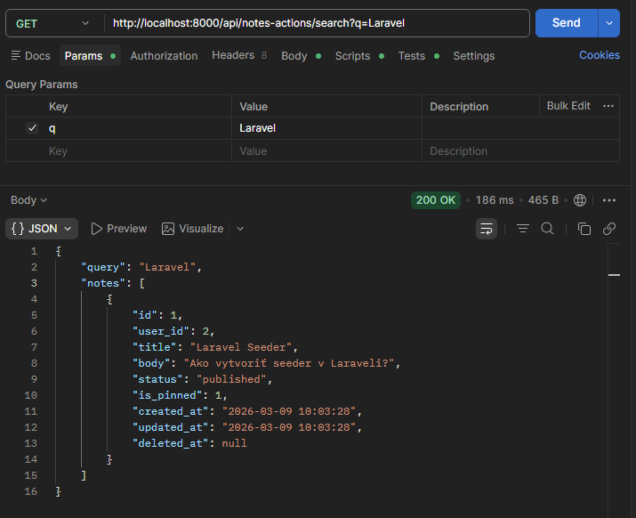

---

## Štatistika podľa statusu

**URI**

```
http://localhost:8000/api/notes/stats/status
```

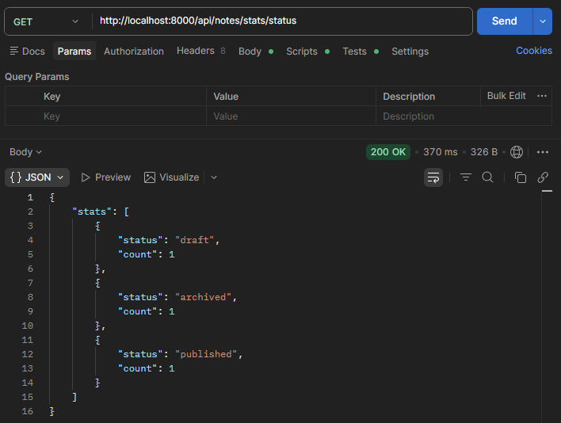

---

## Archivovanie starých draftov

**URI**

```
http://localhost:8000/api/notes/actions/archive-old-drafts
```

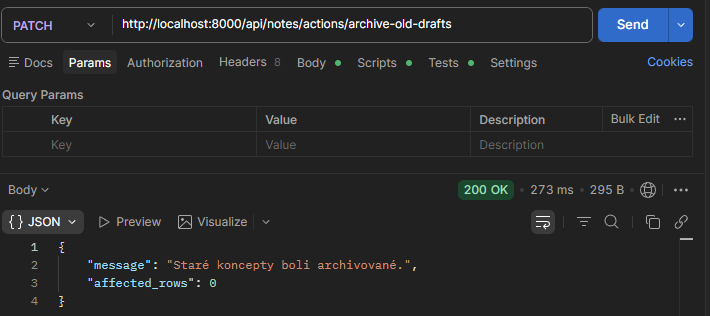

---

## Poznámky používateľa s kategóriami

**URI**

```
http://localhost:8000/api/users/{user}/notes
```

Príklad:

```
http://localhost:8000/api/users/2/notes
```

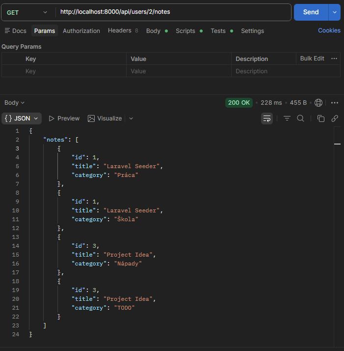

---

## Vlastný endpoint – pinned notes

Endpoint vracia všetky pripnuté poznámky (`is_pinned = true`).

**URI**

```
http://localhost:8000/api/notes/actions/pinned
```

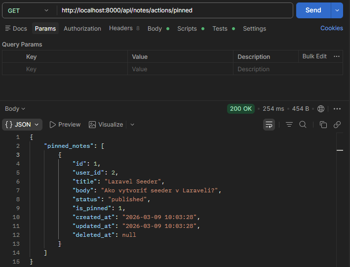

---

# Categories REST API – Laravel

## Získanie všetkých kategórií

**URI**

```
http://localhost:8000/api/categories
```

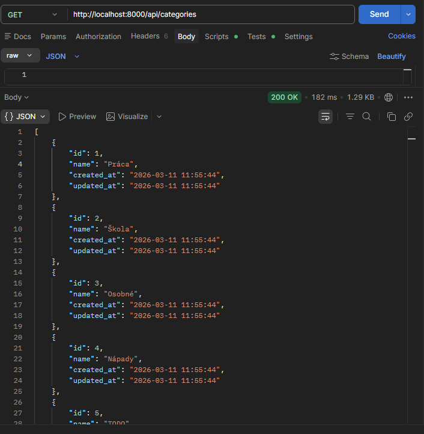

---

## Získanie jednej kategórie

**URI**

```
http://localhost:8000/api/categories/{id}
```

Príklad:

```
http://localhost:8000/api/categories/8
```

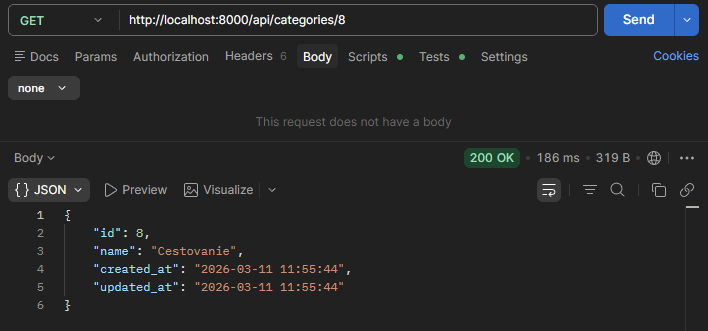

---

## Vytvorenie novej kategórie

**URI**

```
http://localhost:8000/api/categories
```

**Body**

```json
{
  "name": "Nová kategória"
}
```

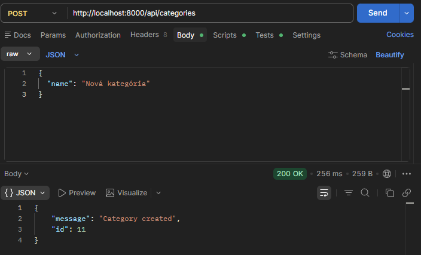

---

## Aktualizácia kategórie

**URI**

```
http://localhost:8000/api/categories/{id}
```

Príklad:

```
http://localhost:8000/api/categories/2
```

**Body**

```json
{
  "name": "school"
}
```

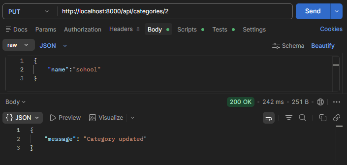

---

## Odstránenie kategórie

**URI**

```
http://localhost:8000/api/categories/{id}
```

Príklad:

```
http://localhost:8000/api/categories/6
```

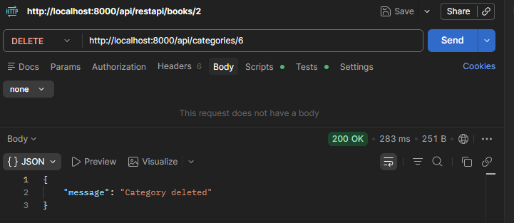

---


---

# Testovanie API

API bolo testované pomocou nástroja **Postman**.
Každý endpoint bol overený pomocou HTTP requestov a odpovedí vo formáte **JSON**.

---

# Autor

Nikola Černá
